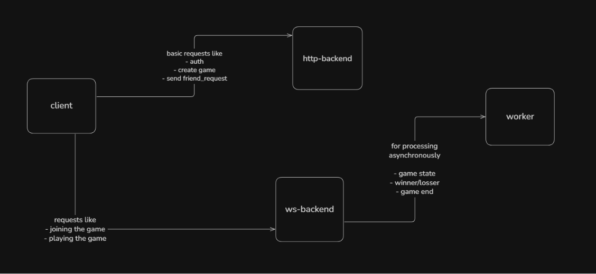

# QuickDuel ⚡

A real-time multiplayer maths game where players compete head-to-head by solving arithmetic questions as quickly as possible.

**Live Demo:** https://games.amitesh.work

---

## Features

* User authentication
* Friend requests and social interactions
* Real-time matchmaking
* Multiplayer gameplay using WebSockets
* Live score updates
* Automatic result calculation
* Persistent game history
* Production-ready deployment setup

---

## Tech Stack

### Frontend

* Next.js
* TypeScript
* Tailwind CSS

### Backend

* Node.js / Bun
* WebSockets
* PostgreSQL
* Redis
* BullMQ

### Infrastructure

* Docker
* Nginx
* AWS
* GitHub Actions (CI/CD)
* Turborepo Monorepo

---

## System Design Highlights

### Real-Time Communication

* WebSocket server for low-latency gameplay.
* Bidirectional communication between players and server.
* Live game state synchronization.

### Matchmaking

* Queue-based player matching using Redis.
* Efficient opponent discovery and game creation.

### Background Processing

* BullMQ workers handle asynchronous jobs:

  * Match creation
  * Result processing
  * Notifications

### Data Persistence

* PostgreSQL stores:

  * Users
  * Friend relationships
  * Match history
  * Game statistics

---

## Technical Challenges Solved

### Handling Concurrent Players

Implemented a queue-driven matchmaking system to avoid race conditions during player pairing.

### Maintaining Consistent Game State

Used WebSockets and server-authoritative state management to keep both players synchronized.

### Scaling Real-Time Systems

Separated responsibilities between HTTP services, WebSocket services, workers, and Redis to make the architecture horizontally scalable.

---

## Monorepo Structure

```text
apps/
packages/
ops/
```

The project uses a Turborepo-based monorepo for sharing code and simplifying development workflows.

---

## Architecture



---

## Running Locally

```bash
git clone https://github.com/DevDesignAmitesh/games
cd games

bun install
docker compose -f ./ops/dev.docker-compose.yml up
```

Configure environment variables:

```bash
cp .env.example .env
```

Start the development servers:

```bash
bun dev
```

---

## What This Project Demonstrates

* Building real-time multiplayer systems
* WebSocket architecture and state synchronization
* Redis-based coordination and queues
* Background job processing with BullMQ
* Production-grade Docker deployments
* CI/CD pipelines
* Monorepo architecture
* Designing scalable backend systems
